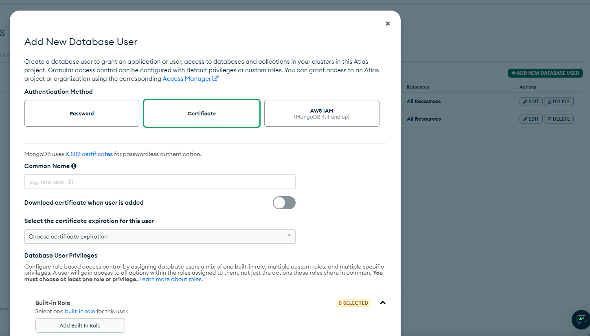
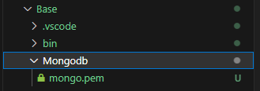

# MongoDB Connector Example

In this example I will walk through the steps I took to make a connector between VRC and a MongoDB database, this will not go super into depth on how every line of code works, but the source code is provided in the [github repository](https://github.com/joshf67/Custom-VRC-Connector) if you wish to look at it.

<span style="color:red"> Warning: There is a lot of code below. Once you get the hang of it, it shouldn't be too difficult, however, it has a steep learning curve due to the compexity of this API so... good luck reading it. </span>

## Requirements

- Store client data on an externally hosted MongoDB and interact with that from within VRC.
- Allow a client to send a login/password to the server which autheticates them with a unique account.
- Allow a client to update a list of items that are stored inside that database and have it display for them.

## Step 0. Setting up the base project

I started by cloning the repository and setting up the inital [server](../manual/Server.md) settings. I then create a new VRC Unity project and installed the [Server Connector Package.]()

## Step 1. Setting up the MongoDB instance

There are a bunch of free MongoDB hosting sites out there, however, I have decided to go with [MongoDB's](https://www.mongodb.com/) own free hosting, [here's a link to their own tutorial on how to set things up.](https://www.mongodb.com/basics/mongodb-atlas-tutorial)

For this example I am going to be using certification authentication so I need to generate one that allows me access to the database:



I stored the generated certificate inside it's own folder.



I setup some properties on my [.env](Server.md) file to allow me to access this easier later on, I also knew that I wanted to make the client "log" into the database by requesting the data for a specific hash:

[see Example server settings for more details](Server.md)

```javascript
    PORT=33646

    MESSAGE_TYPE_BITS=4
    MESSAGE_BITS_LENGTH=21
        
    //This was added during this step
    DATABASE_URL="mongodb+srv://xxxx.xxxx.mongodb.net/RPGDatabase"
    DATABASE_NAME="RPGDatabase"
    DATABASE_CONNECTION_TIMEOUT=2000
    DATABASE_USER_CERT="Mongodb/mongo.pem"

    LOGIN_HASH_CHARACTERS=9
    //This was added during this step

    PRUNE_INACTIVE_TIME_MINUTES=30

    DEVELOPMENT_MODE=true
```

## Step 2. Adding a way to connect to the database in the NodeJS server

The first thing to do is to get out NodeJS server connected to the MongoDB instance:

In the following code you can see a "UserModel" this is just a mongoose schema that lays out the structure of the database, for this example it's multiple schema's layered into each other to produce this structure:

```
User: {
    loginHash: String
    Inventory: {
        Currency: Number
        Items: [
            itemID: Number,
            ...
        ]
    }
}
```

```javascript
const mongoose = require("mongoose");
const path = require("path");
const logger = require("../logger");

//Remove excess data not needed from the database
mongoose.plugin((schema) => {
  schema.options.toJSON = {
    virtuals: true,
    versionKey: false,
    transform(doc, ret) {
      delete ret._id;
      delete ret.id;
    }
  };
});

const UserModel = require("./database-schema/user/user-model");

class DatabaseHandler {
  client;

  constructor() {
    Connect(
      process.env.DATABASE_URL,
      path.join(__dirname, "../../../", process.env.DATABASE_USER_CERT)
    ).then(
      function (client) {
        this.client = client;
      }.bind(this)
    );

    // If the Node process ends, close the Mongoose connection
    process.on("SIGINT", function () {
      mongoose.connection.close(function () {
        logger.log("Mongoose disconnected on app termination");
        process.exit(0);
      });
    });
  }

  /**
   * Request user from database if the hash exists, if not create it
   * @param {string} userLoginHash - The user's login
   * @returns {Promise} The user's database entry
   */
  async addUserData(userLoginHash) {
    return new Promise((resolve, reject) => {
      //Try to get the data before adding it
      this.getUserData(userLoginHash)
        .then((user) => {
          resolve(user);
        })
        .catch((error) => {
          //Generate new user data and save it to the database
          let newUser = new UserModel({ loginHash: userLoginHash });
          newUser.save().finally(() => {
            //Get that saved data from the database
            //Can probably be replaced with a blank response
            this.getUserData(userLoginHash)
              .then((user) => {
                resolve(user);
              })
              .catch((error) => {
                //If the data doesn't exist, something went wrong
                logger.error(error);
                reject(error);
              });
          });
        });
    });
  }

  /**
   * Request user from database if the hash exists
   * @param {string} userLoginHash - The user's login
   * @returns {Promise} The user's database entry
   */
  async getUserData(userLoginHash) {
    return new Promise((resolve, reject) => {
      UserModel.find({ loginHash: userLoginHash })
        .then((value) => {
          if (value.length == 0) {
            reject(`Unable to find user: ${userLoginHash}`);
          } else {
            resolve(value);
          }
        })
        .catch((error) => {
          reject("Unable to find user: " + error);
        });
    });
  }
}

/**
 * Handles connecting to database
 * @param {string} uri - The location of the database
 * @param {string} cert - The certification to connect to the database
 * @returns {Promise} - Returns a promise for the connection
 */
function Connect(uri, cert) {
  return new Promise((resolve) => {
    logger.log("Initiating  connection to database");
    mongoose
      .connect(uri, {
        ssl: true,
        sslValidate: false,
        sslKey: cert,
        sslCert: cert,
        authMechanism: "MONGODB-X509",
      })
      .then((client) => {
        logger.log("Connected to database successfully");
        resolve(client);
      })
      .catch((error) => {
        logger.error(error);
      });
  });
}
```

This allows class tries to connect to a MongoDB instance by using mongoose which is a set of wrapper functions around the MongoDB API to make it easier to use, the connect function was a little complicated for me as I have never done any of this before so, it took me a while to figure out how to connect to the MongoDB with the certification file we downloaded above.

## Step 3. Messaging the NodeJS server from within VRC

As I mentioned before, I decided that I would make the client log into a database using a unique 9 character hash, the first thing to do was to start getting the VRC client to message the server with the hash.

The first thing I implemented on the client was a way to convert a user's input into a 9 character hash, I found a hashing script that [Gorialis made called UdonHashLib](https://github.com/Gorialis/vrchat-udon-hashlib) which I am using to convert a string into a SHA512 hash:

The following C# code is inside a class that extends the [ServerConnector](xref:Joshf67.ServerConnector.Connector) class.

```csharp
    protected UdonHashLib hasher;

    public string ConvertTextToHash(string text)
    {
        return hasher.SHA512_UTF8(text);
    }

    public string ConvertSHA256ToMessage(string hash)
    {
        if (hash.Length != 128) return "";
        return new string(new char[] { hash[0], hash[15], hash[31], hash[47], hash[63], hash[79], hash[95], hash[111], hash[127] });
    }
```

The next step was to setup the UI for a user to execute the login/account creation login
```csharp
    public void Login()
    {
        AddMessagesToBuffer(MessagePacker.PackMessageBytesToURL(GenerateLoginHashBytes(), ConnectorMessageType.Login, packingMessageBitSize, messageTypeSize));
    }

    public void CreateAccount()
    {
        AddMessagesToBuffer(MessagePacker.PackMessageBytesToURL(GenerateLoginHashBytes(), ConnectorMessageType.AccountCreation, packingMessageBitSize, messageTypeSize));
    }
```

That is all that is required on the client side to send off the required requests to the server, next was to handle everything on the NodeJS server.

## Step 4. Handling VRC client messages on the NodeJS server

The first step was to implement the type on the main [message-handler]() section:

```javascript
//Switch statement that handles all different types of messages
    switch (unpackedMessage.Type) {
        case MessageTypes.Login:
            return LoginHandler.HandleInitialMessage(
                user,
                res,
                unpackedMessage.Message
            );
            break;
        case MessageTypes.AccountCreation:
            return LoginHandler.HandleInitialMessage(
                user,
                res,
                unpackedMessage.Message,
                true
            );
            break;
        ...
    }
```

next is to implement a builder to accept the above requests and awaits for the 9 login hash characters until continuing:

```javascript
const logger = require("../../../logger");
const DatabaseHandler = require("../../../database-handler/database-handler");
const UserConnectionData = require("../../../connection-handler/user-connection-data");
const URLMessage = require("../../url-message");
const ResponseHandler = require("../../../response-handler/response-handler");
const ResponseData = require("../../../response-handler/response-data");
const { ResponseTypes } = require("../../../response-handler/response-types");
const MessageBuilder = require("../../message-builder");
const { MessageLength } = require("../../message-length");

class LoginHandler {
  /**
   * Handles the first login related message and sets up a user's expecting data
   * @param {UserConnectionData} user - The user this message is for
   * @param {*} res
   * @param {URLMessage} message - The parsed message from the connection
   * @param {bool} creatingAccount - Controls if the login hash will be used to create a new user
   */
  static HandleInitialMessage(user, res, message, creatingAccount = false) {
    
    //Build the message listener data
    user.expectingDataState = new MessageBuilder(
      LoginHandler.HandleMessageUpdate,
      LoginHandler.HandleMessageFinish,
      MessageLength.Login,
      { creatingAccount: creatingAccount }
    );
    
    //Setup the message listener and then send the remaining message bits into it
    user.expectingDataCallback = user.expectingDataState.AddMessageBytes;
    user.expectingDataCallback(user, res, message);
  }

  /**
   * Handles login related messages that add to the login hash
   * @param {UserConnectionData} user - The user this message is for
   * @param {*} res
   * @param {*} bitsRemaining - The bits remaining until the message is complete
   */
  static HandleMessageUpdate(user, res, bitsRemaining) {
    //If the user is already logged in, return the correct log in
    if (user.loginHash != null) {
      return LoginHandler.HandleLogin(user, res);
    }

    //Continue listening to data
    ResponseHandler.HandleResponse(
      user,
      res,
      new ResponseData(
        ResponseTypes.Login_Updated,
        `Login Hash Part Recieved, Awaiting ${bitsRemaining} bits`
      )
    );
  }

  /**
   * Handles finishing up login related messages to build up a user login hash
   * @param {UserConnectionData} user - The user this message is for
   * @param {*} res
   * @param {string[]} fullMessageBits - The message in a string binary array
   * @param {*} options - The options passed to the message builder on creation
   */
  static HandleMessageFinish(user, res, fullMessageBits, options) {
    let loginBytes = [];
    for (let i = 0; i < MessageLength.Login; i += 8) {
      loginBytes.push(parseInt(fullMessageBits.slice(i, i + 8).join(""), 2));
    }

    const loginHash = new TextDecoder().decode(new Uint8Array(loginBytes));

    logger.log(loginHash);

    //Handle finishing up userHashData message
    user.expectingDataCallback = null;
    user.expectingDataState = null;
    user.userHash = loginHash;

    if (options?.creatingAccount)
      return LoginHandler.HandleAccountCreation(user, res);

    return LoginHandler.HandleLogin(user, res);
  }

```

This Initial message handler sets up all of the parameters of the [message builder]() class to wait for 9 login character's worth of bytes before continuing onto either loggin in or creating an account depending on the message type:

```javascript
  /**
   * Sends off a request to the database to get a user and responds with the result
   * @param {UserConnectionData} user - The user data that contains all required info
   * @param {*} res - The express response for the user
   */
  static HandleLogin(user, res) {
    DatabaseHandler.getUserData(user.userHash)
      .then((userData) => {
        user.databaseData = userData[0];
        return ResponseHandler.HandleResponse(
          user,
          res,
          new ResponseData(ResponseTypes.Login_Complete, userData[0])
        );
      })
      .catch((error) => {
        //Fail due to account not existing or another error
        console.error(error);
        if (error.indexOf("Unable to find user") != -1)
          return ResponseHandler.HandleResponse(
            user,
            res,
            new ResponseData(ResponseTypes.Login_Failed, "User does not exist")
          );
        ResponseHandler.FailResponse(user, res);
      });
  }

  /**
   * Sends off a request to the database to generate a user and responds with the result
   * @param {UserConnectionData} user - The user data that contains all required info
   * @param {*} res - The express response for the user
   */
  static HandleAccountCreation(user, res) {
    DatabaseHandler.addUserData(user.userHash)
      .then((userData) => {
        user.databaseData = userData[0];

        ResponseHandler.HandleResponse(
          user,
          res,
          new ResponseData(ResponseTypes.Account_Creation_Complete, userData[0])
        );
      })
      .catch((error) => {
        //Fail due to account not being able to be created
        console.error(error);
        ResponseHandler.FailResponse(user, res);
      });
  }
}
```

This is everything we need for the first and second requirement, next is to start implementing a way to allow a client to modify their own items

## Step 5. Implementing VRC UI to modify items

This one is quite simple, I decided to go with 2 input fields that take a number and then request build a server response based on a button click:

```csharp
    /// <summary>
    /// Queue up an add item message to the server and attempt to add it
    /// </summary>
    public void AddItem()
    {
        if (AddItemField.text == "") return;

        //Only allow 8 bit indices for the item to add
        byte itemId = (byte)(int.Parse(AddItemField.text) & 0xFF);
        if (itemId < 0 || itemId > 255) return;

        //Set up the options to send to the server's add item function
        //1st bit = adding, next 7 bits = The amount of items to add, next 8 bits... = itemId
        AddMessagesToBuffer(
            MessagePacker.PackMessageBytesToURL(
                new object[] {
                MessagePacker.CompressMessage(true, 1),
                MessagePacker.CompressMessage((byte)1, 7),
                MessagePacker.CompressMessage(itemId)
                }, ConnectorMessageType.ModifyItem, packingMessageBitSize, messageTypeSize
            )
        );
    }

    /// <summary>
    /// Queue up a remove item message to the server and attempt to remove it
    /// </summary>
    public void RemoveItem()
    {
        if (RemoveItemField.text == "") return;

        //Only allow 7 bit indices for removing
        byte itemIndex = (byte)(int.Parse(RemoveItemField.text) & 0xFF);
        if (itemIndex < 0 || itemIndex > 255) return;

        DataList packingParams = new DataList();
        packingParams.Add(MessagePacker.CompressMessage(false, 1));
        packingParams.Add(MessagePacker.CompressMessage((byte)1, 7));
        packingParams.Add(MessagePacker.CompressMessage(itemIndex));

        //Set up the options to send to the server's add item function
        //1st bit = removing, next 7 bits = The amount of indices to remove, next 8 bits... = index to remove
        AddMessagesToBuffer(
            MessagePacker.PackMessageBytesToURL(
                packingParams, ConnectorMessageType.ModifyItem,
                packingMessageBitSize, messageTypeSize
            )
        );
    }
```

Because I am trying to do both adding/removing by only using a single type I needed to package my messages a little bit more complicated, I started off by using the first bit of a message to indicate if it was adding or removing, then the next 7 bits to indicate how many actions the server should wait for when building up the message. Finally I pack the item indices/ids as bytes one after another, this will be parsed using the action count in the 7 bits.

## Step 6. Modifying a client's items

The first part is to add another type to our main [message-handler]() logic:

```javascript
case MessageTypes.ModifyItem:
    return ItemHandler.HandleInitialMessage(
        user,
        res,
        unpackedMessage.Message
    );
    break;
```

For these sets of methods I have decided that I want to try and only use 1 type for adding and removing, this means that the initial message building will be slightly more complicated than the login one:

```javascript
const logger = require("../../../logger");
const UserConnectionData = require("../../../connection-handler/user-connection-data");
const ResponseHandler = require("../../../response-handler/response-handler");
const ResponseData = require("../../../response-handler/response-data");
const { ResponseTypes } = require("../../../response-handler/response-types");
const { MessageLength } = require("../../message-length");
const MessageBuilder = require("../../message-builder");
const {
  ItemSchemaJS,
} = require("../../../database-handler/database-schema/inventory/item-schema");

class ItemHandler {
  /**
   * Handles the first item related message and sets up a user's expecting data
   * @param {UserConnectionData} user - The user this message is for
   * @param {*} res
   * @param {String[]} message - The parsed message from the connection
   */
  static HandleInitialMessage(user, res, message) {
    //First bit of a Item message is use to determine if it should be adding or removing
    let addingItems = message[0] == "1";

    //The next 7 bits are used to store how many items/indices are in the message
    let items = parseInt(message.slice(1, 8).join(""), 2);

    //Build the message listener data
    user.expectingDataState = new MessageBuilder(
      ItemHandler.HandleMessageUpdate,
      ItemHandler.HandleMessageFinish,
      addingItems == true
        ? MessageLength.Item * items
        : MessageLength.ItemIndex * items,
      {
        addingItems: addingItems,
        items: items,
      }
    );

    //Setup the message listener and then send the remaining message bits into it
    user.expectingDataCallback = user.expectingDataState.AddMessageBytes;
    user.expectingDataCallback(user, res, message.slice(8));
  }

  /**
   * Handles item related messages
   * @param {UserConnectionData} user - The user this message is for
   * @param {*} res
   * @param {*} bitsRemaining - The bits remaining until the message is complete
   */
  static HandleMessageUpdate(user, res, bitsRemaining) {
    //Continue listening to data
    ResponseHandler.HandleResponse(
      user,
      res,
      new ResponseData(
        ResponseTypes.Item_Updated,
        `Item message Recieved, Awaiting ${bitsRemaining} bits`
      )
    );
  }

  /**
   * Handles finishing up item messages
   * @param {UserConnectionData} user - The user this message is for
   * @param {*} res
   * @param {string[]} fullMessageBits - The message in a string binary array
   * @param {*} options - The options passed to the message builder on creation
   */
  static HandleMessageFinish(user, res, fullMessageBits, options) {
    if (options.addingItems) {
      let items = [];

      //Build up all of the items to add from the message bits
      for (let i = 0; i < options.items * MessageLength.Item; i += MessageLength.Item) {
        items.push(
          new ItemSchemaJS(
            parseInt(fullMessageBits.slice(i, i + MessageLength.Item).join(""), 2)
          )
        );
      }

      logger.log(items);
      ItemHandler.AddItems(user, res, items);
    } else {
      let indices = [];

      //Build up all of the indices from the message bits
      for (let i = 0; i < options.items * MessageLength.Item; i += MessageLength.Item) {
        indices.push(
          parseInt(fullMessageBits.slice(i, i + MessageLength.ItemIndex).join(""), 2)
        );
      }

      logger.log(indices);
      ItemHandler.RemoveItems(user, res, indices);
    }
  }
  ...
```

This time I decided to pass a few encoded messages inside the initial message, the first part is to tell the server what type of message this adding or removing, I do this by using the first bit in the message, I then follow that up with the next 7 bits being for the amount of actions this message should be expecting (In this example it's how many actions to remove/add will follow), after this I plan to send a single byte per action (0-255).

The [message-builder]() class has a parameter for any options that you wish to pass to the final message function, in this case we store how many actions are in the message and wether we are removing or adding items.

After the message has been fully built out, we can call a function to either add or remove:

```javascript
  /**
   * Handles item addition
   * @param {UserConnectionData} user - The user this message is for
   * @param {*} res
   * @param {ItemSchemaJS[]} items - The items to be added
   */
  static AddItems(user, res, items) {
    //Update the local inventory items
    user.databaseData.Inventory.Items =
      user.databaseData?.Inventory?.Items?.concat?.(items);

    //Fire off a request to save the data into the database
    user.databaseData
      .save()
      .then((saved) => {
        //If it saved then respond with succeeded message
        ResponseHandler.HandleResponse(
          user,
          res,
          new ResponseData(ResponseTypes.Added_item, items)
        );
      })
      .catch((error) => {
        logger.warn(error);
        ResponseHandler.HandleResponse(
          user,
          res,
          new ResponseData(ResponseTypes.Server_Error)
        );
      });
  }

  /**
   * Handles item removal
   * @param {UserConnectionData} user - The user this message is for
   * @param {*} res
   * @param {int[]} indices - The item indexes to be removed
   */
  static RemoveItems(user, res, indices) {
    /* sort all of the indices by largets first so that when we remove
       any items it wont affect the rest of the indices position
       and remove any indices that are above the actual inventory item count */
    indices = indices.sort((a, b) => {
      return a - b;
    }).filter(
      (index) => index < (user.databaseData?.Inventory?.Items.length ?? 0)
    );

    //If there are no indices left then we don't need to message the database, so respond
    if (indices.length == 0) {
      return ResponseHandler.HandleResponse(
        user,
        res,
        new ResponseData(ResponseTypes.Removed_item, indices)
      );
    }  

    //Remove all of the incides
    indices.forEach((index) => {
      user.databaseData?.Inventory?.Items?.splice?.(index, 1);
    });

    //Fire off a request to save the data into the database
    user.databaseData
      .save()
      .then((saved) => {
        //If it saved then respond with succeeded message
        ResponseHandler.HandleResponse(
          user,
          res,
          new ResponseData(ResponseTypes.Removed_item, indices)
        );
      })
      .catch((error) => {
        logger.warn(error);
        ResponseHandler.HandleResponse(
          user,
          res,
          new ResponseData(ResponseTypes.Server_Error)
        );
      });
  }
}
```

and that's it, implementing the adding/removing of items was a lot easier to do due to having the message building all fleshed out in the login section

## Step 7. Implementing VRC UI Display for all of the above code

In order to easily display that the client's inputs are actually working, I decided to display them in text for the client to see.

The first thing I need for this, is to create a [ServerResponse](xref:Joshf67.ServerConnector.Server.ServerResponse) to handle the response from the NodeJS server inside VRC, this will be a very simple response that I will hardcode a response message for based on what the server should respond with:

```csharp
/// <summary>
/// Example response to show how to handle server responses
/// </summary>
public class ExampleServerResponse : ServerResponse
{

    /// <summary>
    /// Handles the parsed message
    /// </summary>
    /// <param name="response"> The JSON DataDictionary to be handled </param>
    /// <param name="HandleResult"> The result of the ServerRespons handler </param>
    /// <returns> Boolean if the response was parsed properly </returns>
    override protected bool HandleResponse(DataDictionary response, out DataToken HandleResult)
    {
        HandleResult = new DataToken(DataError.None);
        bool messageWasParsedSucessfully = false;

        if (Type == ServerResponseType.Login_Failed)
        {
            if (DevelopmentManager.IsServerResponseEnabled(DevelopmentMode.Basic))
                Debug.Log("ServerExampleResponse is handling a login failed type");

            //The login has failed for some reason, so we need to display this to the user
            HandleResult = new DataToken("Login credentials are invalid, please try again or create an account");
        }
        else if (Type == ServerResponseType.Login_Updated)
        {
            if (DevelopmentManager.IsServerResponseEnabled(DevelopmentMode.Basic))
                Debug.Log("ServerExampleResponse is handling a login update type");

            //Server sends message with a string response so this will display the bits remaining until login completion
            messageWasParsedSucessfully = response.TryGetValue("response", TokenType.String, out HandleResult);
        }
        else if (Type == ServerResponseType.Login_Complete)
        {
            if (DevelopmentManager.IsServerResponseEnabled(DevelopmentMode.Basic))
                Debug.Log("ServerExampleResponse is handling a login complete type");

            messageWasParsedSucessfully = response.TryGetValue("response", TokenType.DataDictionary, out HandleResult);
        }
        else if (Type == ServerResponseType.Account_Creation_Complete)
        {
            if (DevelopmentManager.IsServerResponseEnabled(DevelopmentMode.Basic))
                Debug.Log("ServerExampleResponse is handling a account creation complete type");

             messageWasParsedSucessfully = response.TryGetValue("response", TokenType.DataDictionary, out HandleResult);
        }
        else if (Type == ServerResponseType.Item_Updated)
        {
            if (DevelopmentManager.IsServerResponseEnabled(DevelopmentMode.Basic))
                Debug.Log("ServerExampleResponse is handling a item update type");

            //Server sends message with a string response so this will display the bits remaining until item adding/remove message completion
            messageWasParsedSucessfully = response.TryGetValue("response", TokenType.String, out HandleResult);
        }
        else if (Type == ServerResponseType.Added_Item)
        {
            if (DevelopmentManager.IsServerResponseEnabled(DevelopmentMode.Basic))
                Debug.Log("ServerExampleResponse is handling a Added item type");

            messageWasParsedSucessfully = response.TryGetValue("response", TokenType.DataList, out HandleResult);
        }
        else if (Type == ServerResponseType.Removed_Item)
        {
            if (DevelopmentManager.IsServerResponseEnabled(DevelopmentMode.Basic))
                Debug.Log("ServerExampleResponse is handling a Removed item type");

            messageWasParsedSucessfully = response.TryGetValue("response", TokenType.DataList, out HandleResult);
        }

        return !messageWasParsedSucessfully;
    }
}
```

Now that I have something that will store the response from the server, I can continue onto modifying my "ExampleDatabaseConnector" to handle this [ServerResponse](xref:Joshf67.ServerConnector.Server.ServerResponse):
```csharp

    /// <summary>
    /// The field used to display all the user's items
    /// </summary>
    public Text itemField;
    
    /// <summary>
    /// The field used to display the server's responses to the user
    /// </summary>
    public Text responseField;

    /// <summary>
    /// The server response handler to be used for this example
    /// </summary>
    public ExampleServerResponse ExampleResponseParser;

    private DataList items = new DataList();

    /// <summary>
    /// Take a UserSchema and setup the display for the data
    /// </summary>
    /// <param name="userData"> The user data to use with the setup </param>
    private void SetupUserData(DataToken userData)
    {
        //This is basically the same as the user schema on the server but in C#
        if (!UserSchema.IsUserSchema(userData, out DataDictionary userSchema))
        {
            if (DevelopmentManager.IsConnectorEnabled(DevelopmentMode.Basic))
                Debug.Log("Trying to setup user data with invalid data, is not UserSchema");

            return;
        }

        currency = InvetorySchema.GetCurrency(userData);
        items.Clear();
        items = InvetorySchema.GetInventoryItems(userData);

        RenderInventoryText();
    }

    /// <summary>
    /// Renders out the inventory to the display
    /// </summary>
    private void RenderInventoryText()
    {
        itemField.text = $"Currency: {currency}\n";
        for (int i = 0; i < items.Count; i++)
        {
            itemField.text += $"Item {i}: {ItemSchema.GetItemID(items[i])}\n";
        }
    }

    /// <summary>
    /// Accept any responses from the server and handle them
    /// </summary>
    /// <param name="response"> The response from the server </param>
    public override void HandleMessage(string response)
    {

        if (DevelopmentManager.IsConnectorEnabled(DevelopmentMode.Basic))
            Debug.Log("Server message has been recieved and is being handled by example connector");

        ExampleResponseParser.Parse(response, out DataToken HandlerResult);
        switch (ExampleResponseParser.Type)
        {
            case ServerResponseType.Login_Updated:
                responseField.text = $"Recieved a login update message with the response: {HandlerResult.String}";
                break;

            case ServerResponseType.Login_Complete:
                SetupUserData(ExampleResponseParser.Content);
                responseField.text = $"Recieved a login complete message with the response: {UserSchema.GetLoginHash(HandlerResult.DataDictionary)}";
                break;

            case ServerResponseType.Login_Failed:
                responseField.text = $"Recieved a login failed message with the response: {HandlerResultString}";
                break;

            case ServerResponseType.Account_Creation_Complete:
                responseField.text = $"Recieved a account creation succeeded message with the response:{UserSchema.GetLoginHash(HandlerResult.DataDictionary)}";
                break;

            case ServerResponseType.Added_Item:
                if (ExampleResponseParser.Content.TokenType == TokenType.DataList)
                {
                    for (int i = 0; i < ExampleResponseParser.Content.DataList.Count; i++)
                    {
                        items.Add(ExampleResponseParser.Content.DataList[i].DataDictionary);
                    }
                }
                else
                {
                    if (DevelopmentManager.IsConnectorEnabled(DevelopmentMode.Basic))
                        Debug.Log("Server response has returned with an add item type but the message was in a incorrect format");
                }
                responseField.text = $"Recieved a add item message adding items: {HandlerResult.DataList.Count}";
                RenderInventoryText();
                break;

            case ServerResponseType.Removed_Item:
                if (ExampleResponseParser.Content.TokenType == TokenType.DataList)
                {
                    for (int i = 0; i < ExampleResponseParser.Content.DataList.Count; i++)
                    {
                        if (Convert.ToInt32(ExampleResponseParser.Content.DataList[i].Double) < items.Count)
                            items.RemoveAt(Convert.ToInt32(ExampleResponseParser.Content.DataList[i].Double));
                    }
                }
                else
                {
                    if (DevelopmentManager.IsConnectorEnabled(DevelopmentMode.Basic))
                        Debug.Log("Server response has returned with an remove item type but the message was in a incorrect format");
                }
                responseField.text = $"Recieved a remove item message removing items: {HandlerResult.DataList.Count}";
                RenderInventoryText();
                break;
            default:
                if (DevelopmentManager.IsConnectorEnabled(DevelopmentMode.Basic))
                    Debug.Log("Server response has returned with an unhandle type: " + ExampleResponseParser.Type);
                responseField.text = "Recieved an invalid message response type";
                break;
        }
    }
```

And that's it, I can now link up the text fields and whenever the "ExampleDatabaseConnector" recieves a message it should render it to a display that makes sense for the user

## Final Thoughts

This was kind of complicated to implement, however once you have a single bit of logic built, you can copy and paste a lot of the code into other logic to expand on this greatly.

## Next Steps

As you might have noticed, I have left out the currency value from the example, why don't you try to use what I've shown above and implement a way to increase/decrease/set this value and have it be displayed on the user's side.