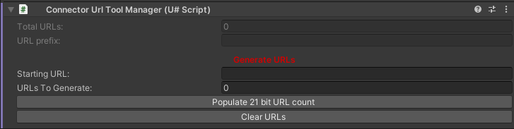
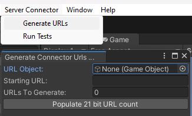

# Configuring VRC Settings

There are two methods to generate the URLs for the connection:

## ConnectorUrl Tool Inspector

In order to use this tool you need to add it to a GameObject and supply the starting URL and the total URLs to generate.

Once you supply the required parameters a "Generate URLs" button will appear, this will generate all of the VRCUrls required and set up the URL containers for the GameObject.

There is a helper button for calculating the total URLs required for a 21 bit message, if you are using a custom message length then please calulate the required URLs to fit your bits required:

```math
$(2^MESSAGE_BITS_LENGTH) $$
```



<br>

## ConnectorUrl Tool Window

In order to use this tool you need open the window by clicking on "Server Connector" in the top toolbar, as this is a object independent version of the [ConnectorUrl Tool Inspector](#connectorurl-tool-inspector) (see link for the parameters) you need to also supply the object to create the URLs under.

